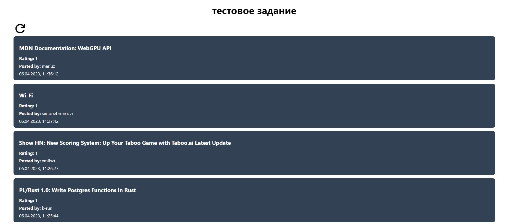
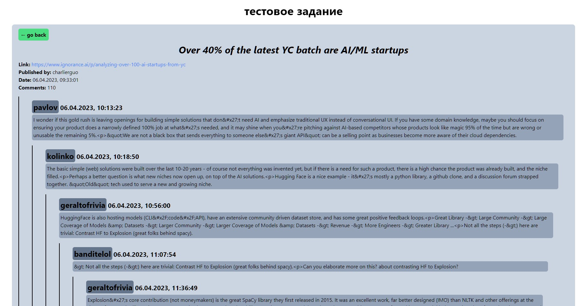

# Тестовое для работодателя

Демо: https://003-test-react-ts-hacker-news-api.vercel.app/

Локально поднимается через yarn install + yarn dev

1. Проект инициализирован через Vite
2. Создан на TS, React, React Router, Tailwind
3. Для загрузки создан кастом хук useAsync
4. Для более плавного отображения создан хук useInfiniteScroll
5. Так как API отдает только id постов, пришлось использовать спиннер для отображения загрузки массива id и плейсхолдеры на месте строк, на время загрузки данных с каждого конкретного поста
6. Вложенные комментарии подгружаются рекурсивно через компонент SingleComment

Примеры:

